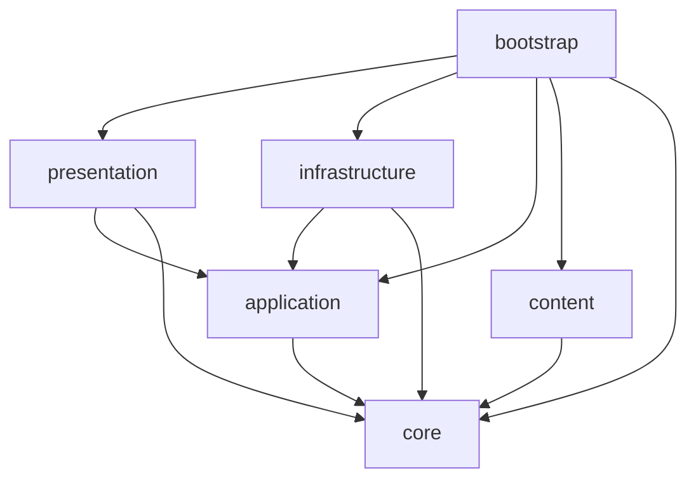

# Architecture

Ascension uses dependency inversion to keep game rules deterministic and independent of Phaser. Phaser 4 is replaceable presentation infrastructure, not the owner of game state or rules.

## Source tree

```text
src/
├── core/                 Pure game state, rules, values, and domain results
├── application/          Use cases and ports
├── content/              Declarative game definitions
├── infrastructure/       Persistence and other external-service adapters
├── presentation/
│   └── phaser/           Phaser rendering, input, and Scene adapters
└── bootstrap/            Composition root and process startup
```

Directories may remain empty until behavior needs them. Put code by responsibility, not by convenience.

## Dependency direction

An arrow means “may import.”



The six enforced rules are: no circular dependencies; `core` imports no source layer; `application` imports no adapter, content, or bootstrap code; `content` imports only `core`; `infrastructure` imports only `application` and `core`; and `presentation` imports only `application` and `core`. `bootstrap` is deliberately unrestricted inside `src` because it composes the system.

| Importing layer  | Legal project-layer dependencies |
| ---------------- | -------------------------------- |
| `core`           | None                             |
| `application`    | `core`                           |
| `content`        | `core`                           |
| `infrastructure` | `application`, `core`            |
| `presentation`   | `application`, `core`            |
| `bootstrap`      | All layers                       |

External packages do not bypass these rules. In particular, Phaser imports are allowed only in `presentation` and `bootstrap`.

`core`, `application`, and `content` form the pure layers. Their production modules may not import Node core modules or npm packages, and their dedicated TypeScript compilation excludes browser libraries and ambient types. Pure-layer `*.test.ts` modules may import Vitest, but production modules may not.

## Layer contracts

### Core

- **Responsibility:** authoritative game state, entities, value objects, deterministic rules, and typed domain results.
- **Public usage:** application use cases invoke pure operations and consume explicit results.
- **Dependencies:** no project layer, Phaser, browser or Node APIs, external packages, persistence, ambient time, or unseeded randomness.

An invalid action returns a typed failure and leaves state unchanged. Do not partially mutate and then report failure.

### Application

- **Responsibility:** use cases that coordinate core behavior and define ports required from the outside world.
- **Public usage:** presentation calls use cases; bootstrap injects adapter implementations.
- **Dependencies:** `core` only; no browser or Node APIs or external packages in production modules.

Define persistence and seeded-randomness interfaces here when a use case needs them. Infrastructure implements both ports; bootstrap only constructs and injects those adapters. Passing a seed or port makes outcomes replayable and testable.

### Content

- **Responsibility:** declarative, data-first definitions such as technologies, structures, species, maps, and balance values.
- **Public usage:** bootstrap loads definitions and passes validated data into the system.
- **Dependencies:** `core` only, generally for types and value construction; no browser or Node APIs or external packages in production modules.

Content describes facts; it does not orchestrate use cases, render itself, or access services.

### Infrastructure

- **Responsibility:** adapters for persistence, seeded randomness, serialization, storage, and other external services.
- **Public usage:** bootstrap constructs adapters and passes them to application ports.
- **Dependencies:** `application` and `core`.

Future save loading must validate schema and version before constructing domain objects. This is an architecture rule for future implementation, not a claim that saving exists today.

### Presentation and Phaser

- **Responsibility:** translate input into application requests and application state/events into visuals and audio.
- **Public usage:** bootstrap creates presentation adapters with application-facing dependencies.
- **Dependencies:** `application`, `core`, and presentation-specific external packages such as Phaser.

Authoritative game state belongs outside Phaser Scenes. Scenes coordinate rendering, input, and lifecycle; they do not implement game rules. Register subscriptions during the appropriate lifecycle phase and remove them on Scene shutdown so restarts cannot duplicate handlers.

### Bootstrap

- **Responsibility:** start the process, construct adapters, load content, and wire dependencies.
- **Public usage:** browser entry point only.
- **Dependencies:** every layer as needed.

Bootstrap contains composition, not game behavior.

## Placement examples

| Future code                                               | Layer                 |
| --------------------------------------------------------- | --------------------- |
| Colony production calculation or invalid-build result     | `core`                |
| “End turn” orchestration and its persistence/random ports | `application`         |
| Technology costs and species definitions                  | `content`             |
| Local-storage save adapter and save-schema validation     | `infrastructure`      |
| Seeded PRNG adapter                                       | `infrastructure`      |
| Hex selection input, camera controls, sprites, and HUD    | `presentation/phaser` |
| Phaser configuration and adapter construction             | `bootstrap`           |

If code spans responsibilities, split it at the application port or typed core boundary instead of making layers import each other.

## Enforcement

Run the exact repository checks:

```sh
npm run arch:check
npm run lint
npm run typecheck
```

`arch:check` enforces the dependency graph and pure-layer production import restrictions in `dependency-cruiser.config.cjs`; lint restricts Phaser imports; type checking uses `tsconfig.pure.json` to compile `core`, `application`, and `content` without browser libraries or ambient types. `npm run check` runs these with formatting, tests, and the production build.
